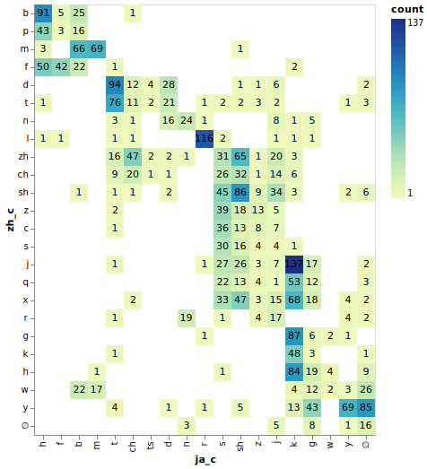

# Erq Mojidata Examples

## Correspondence between the initial consonants of Japanese and standard Chinese pronunciation

- Query: [jazh-consonants.erq](jazh-consonants.erq)
- Command: `npx erq --init mojidata.erq <examples/jazh-consonants.erq`
- Output: [jazh-consonants.svg](output/jazh-consonants.svg)
